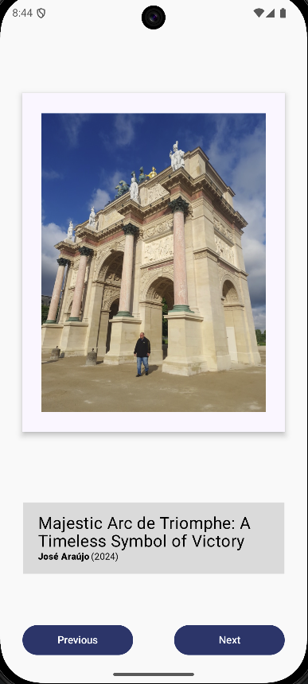
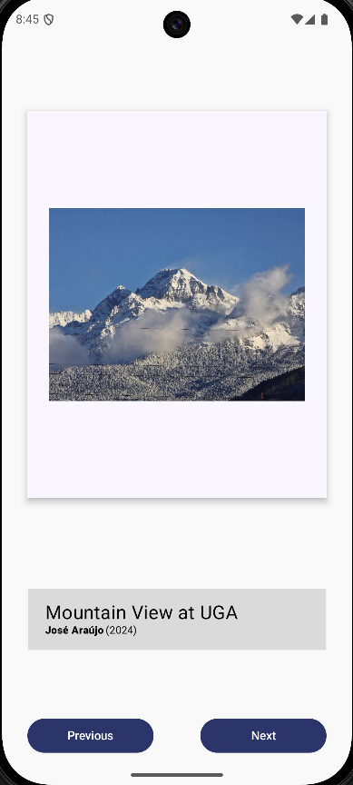

# Art Space

**Art Space** est une application Android développée avec Kotlin et Jetpack Compose. Cette
application a été créée dans le but de pratiquer et de mieux comprendre les concepts de Jetpack
Compose, en particulier la gestion de l'interface utilisateur.

L'application présente une galerie d'art virtuelle où les utilisateurs peuvent parcourir des photos
 et d'oeuvres d'art (photos ou peintures) en utilisant des boutons "Previous" et "Next". Chaque œuvre est
accompagnée d'un titre, du nom de l'artiste (ou du photographe) et de la date de création.

## Fonctionnalités

- Affichage d'une image (photo ou peinture) avec son titre, le nom de l'artiste et la date.
- Boutons "Previous" et "Next" pour naviguer entre les œuvres.
- Interface utilisateur moderne et réactive grâce à Jetpack Compose.

## Captures d'écran

  
*Exemple d'écran principal avec une photo affichée.*

  
*Navigation vers une autre photo avec les boutons "Previous" et "Next".*

## Technologies utilisées

- **Kotlin** : Langage de programmation principal pour le développement Android.
- **Jetpack Compose** : Framework moderne pour la création d'interfaces utilisateur déclaratives.
- **Android Studio** : Environnement de développement intégré (IDE) utilisé pour le projet.

## Comment exécuter le projet

1. Clonez ce dépôt sur votre machine locale :
   ```bash
   git clone https://github.com/AraujoJs/ArtSpaceApp.git
   ```